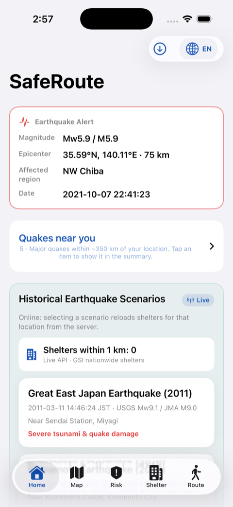
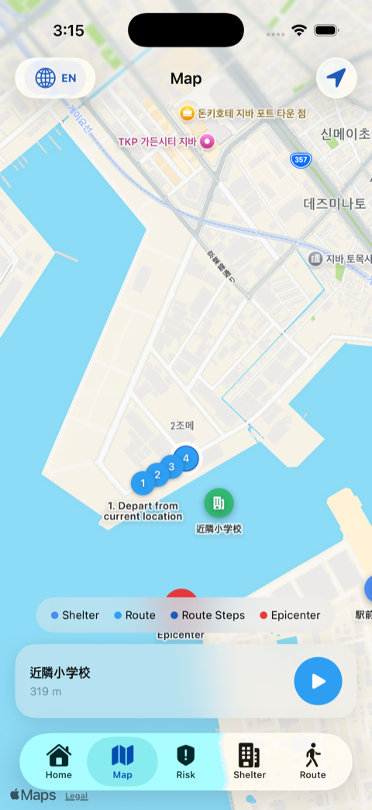
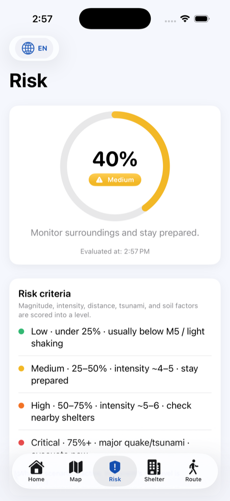
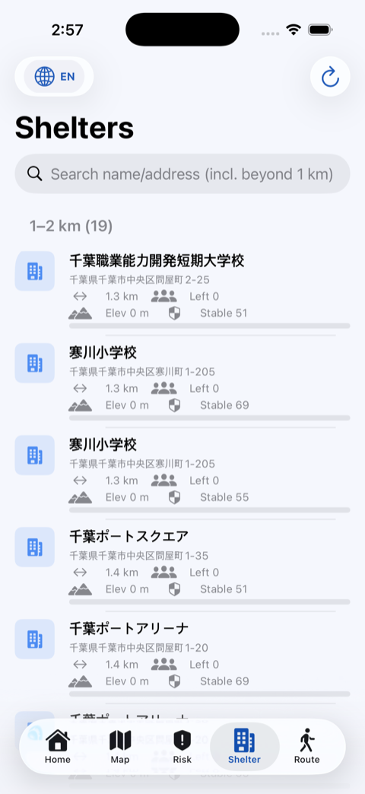
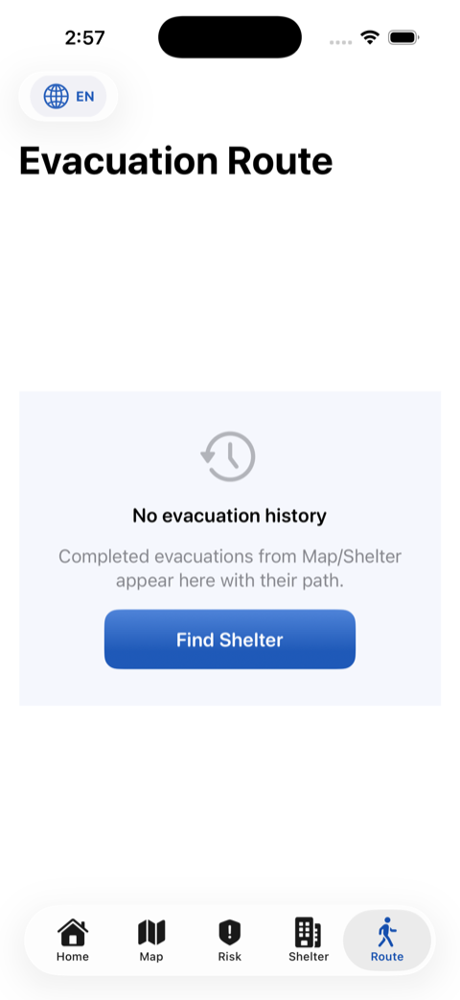
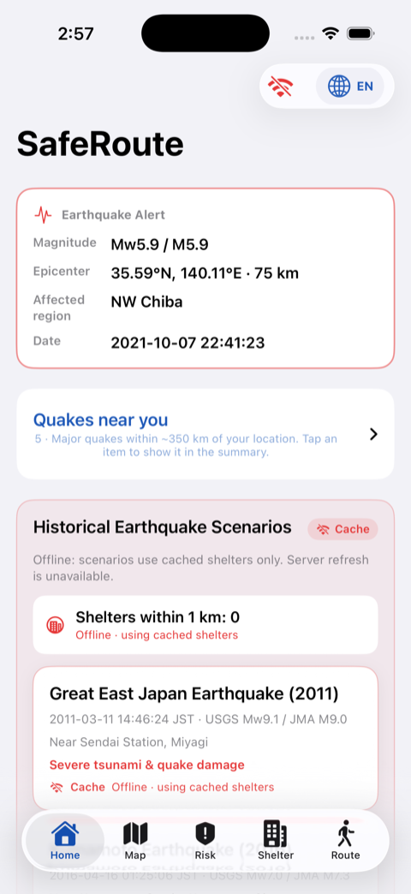

# SafeRoute Japan

일본 지진 대피를 돕는 **SwiftUI iOS 앱**입니다.  
가까운 지정 대피소 · 도보 경로 · 위험도 · 오프라인 캐시를 한 흐름으로 제공합니다.

---

## 주요 기능

- **5개 탭**: 홈 · 지도 · 위험도 · 대피소 · 경로
- **역사 지진 시나리오** 4건으로 위치·대피소·안내 시뮬레이션
- **위치 기반 지역 지진 목록** (드롭다운, 약 350 km)
- **온라인 / 오프라인** 전환 · SwiftData 캐시
- **다국어**: 한국어 · English · 日本語 · 中文
- **MapKit** 진앙·대피소 핀 · 도보 경로
  
---

## 동작 예시

시뮬레이터에서 실제 실행한 화면입니다. (시나리오: 치바현 북서부 지진 2021 · 진도 5)

### 홈 — 지진 요약 · 지역 기록 · 시나리오

규모 · 진원지 · 발생지역 · 발생일을 요약하고, **내 지역 지진 기록** 드롭다운과 역사 시나리오 카드를 제공합니다.

  

### 지도 — 진앙 · 대피소 · 위치 위험

진앙 마커와 범례, 현재 위치 위험 배지(Medium 등)를 지도 위에 표시합니다.

  

### 위험도 — 점수 · 판별 기준

위험 점수 게이지와 Low~Critical **판별 기준**을 한눈에 보여 줍니다.

  

### 대피소 — 거리 구간 목록 · 검색

거리 밴드별 대피소 목록과 검색, 상세·대피 시작으로 이어집니다.

  

### 경로 — 대피 여행 기록

완료된 대피 기록과 공유 화면입니다. (기록이 없으면 대피소 탭으로 유도)

  

### 오프라인 — 캐시 모드

오프라인 전환 시 빨간 Wi‑Fi 끊김 아이콘과 캐시 기반 시나리오 UI로 바뀝니다.

  

---

## 화면 요약

| 탭 | 역할 |
|----|------|
| **홈** | 지진 속보 요약, 지역 지진 드롭다운, 역사 시나리오, 오프라인 준비 |
| **지도** | 진앙·대피소 핀, 경로, 위치 위험 |
| **위험도** | 점수·등급, 판별 기준, 행동 수칙 |
| **대피소** | 거리별 목록·검색·대피 시작 |
| **경로** | 대피 여행 기록·공유 |

---

## 역사 지진 시나리오

| 이름 | 규모 | 위험 |
|------|------|------|
| 동일본 대지진 (2011) | Mw9.1 / M9.0 | CRITICAL · 쓰나미 |
| 구마모토 지진 (2016) | Mw7.0 / M7.3 | CRITICAL · 가옥 붕괴 |
| 노토반도 지진 (2024) | Mw7.5 / M7.6 | CRITICAL · 쓰나미·산사태 |
| 치바현 북서부 지진 (2021) · 진도 5 | Mw5.9 / M5.9 | MEDIUM · 중진 |

---

## 오프라인 / 온라인

- **오프라인 준비**: 주변 대피소를 기기에 저장
- **오프라인 전환**: 캐시만 사용 (툴바·목록에 빨간 `wifi.slash`)
- **갑작스런 끊김**: 현재 목록을 캐시에 남기고 계속 안내

---

## 라이선스

[LICENSE](LICENSE) 참고.
